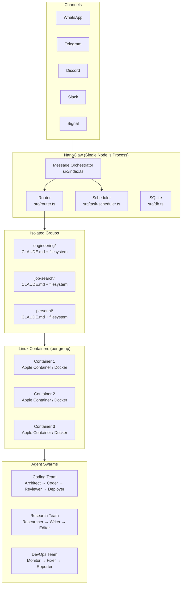

# 🐚 AI-Agent-NanoClaw

<p align="center">
  
</p>

<p align="center">
  <a href="https://github.com/qwibitai/NanoClaw"></a>
  <a href="LICENSE"></a>
  <a href="https://ai-agent-nanoclaw.vercel.app"></a>
  
  
</p>

> **Agent Swarms. Container Isolation. Claude-Native Intelligence.**

🌐 **[Live Website](https://ai-agent-nanoclaw.vercel.app)** · 📖 **[Docs](https://nanoclaw.dev)** · 🚀 **[Quick Start](#quick-start)**

---

## 🐚 Overview
**NanoClaw** is the first personal AI assistant to support full **Agent Swarms**. Built on the Claude Agent SDK, it isolates every agent group in its own Linux container, providing OS-level security and a clean, self-modifying codebase.

### 🛡️ Core Principles
- **Isolation**: Containers ensure your personal data and agent workspace never bleed.
- **Self-Modification**: Use the assistant to add new features to itself via "/add" commands.
- **Swarm Support**: Orchestrate multiple specialized agents to solve complex problems.

---

## 🏗️ Architecture



---

## 🛠️ Skills-as-Transformations
NanoClaw doesn't just call tools; it **transforms itself**. Use these commands to inject features directly into the core.

| Skill | Command | Description |
|-------|---------|-------------|
| **`add-discord`** | `/add-discord` | Inject professional Discord support with threads and rich embeds. |
| **`add-github-actions`**| `/add-github-actions` | Auto-configure robust CI/CD pipelines for your workspace. |
| **`add-linear`** | `/add-linear` | Connect your agent to the Linear project management tool. |
| **`add-obsidian`** | `/add-obsidian` | Mount your Obsidian vault directly into the agent's container. |
| **`add-supabase`** | `/add-supabase` | Add persistent database storage for task tracking and analytics. |
| **`add-telegram`** | `/add-telegram` | Installs Telegram channel support: deps, adapter, bot token config |
| **`add-gmail`** | `/add-gmail` | Adds Gmail: IMAP monitoring, Claude composition, approval workflow |

---

## 👥 Agent Swarms
Orchestrate a team of agents that work together.

### Coding Team (4 agents)
- **Architect**: Designs system, writes ADRs, defines API contracts
- **Coder**: Implements features, writes tests
- **Reviewer**: Code quality, security audit, test coverage check
- **Deployer**: Ships to Vercel/Railway/Render

### DevOps Team (3 agents, 24/7)
- **Monitor**: Watches all 60 repos for CI failures and deployment health
- **Fixer**: Auto-patches issues (dependency bumps, broken links)
- **Reporter**: Generates status dashboards

---

## 📂 Repository Structure

```text
AI-Agent-NanoClaw/
├── .claude/
│   ├── skills/                # Skill-as-transformation source code
│   │   ├── add-discord/       # Discord adapter transformation
│   │   ├── add-github-actions/# CI/CD pipeline injection
│   │   ├── add-telegram/
│   │   ├── add-gmail/
│   │   └── add-supabase/
│   └── memory/                # Persistent context storage
├── assets/                    # Project branding & assets
├── groups/                    # Isolated group configs (engineering, personal)
│   ├── engineering/
│   ├── job-search/
│   └── personal/
├── scheduled-tasks/           # Recurring automation definitions
│   ├── daily-github-digest.md # Automated activity briefings
│   ├── monday-briefing.md
│   └── friday-review.md
├── swarms/                    # Agent swarm logic and team roles
│   ├── coding-team/
│   ├── research-team/
│   └── social-media-team/     # Content creation pipeline
├── use-cases/                 # Real-world deployment scenarios
│   ├── agent-swarm-coding/    # Multi-agent development
│   └── self-modifying-agent/  # Meta-programming guide
├── website/                   # Next.js Site
└── docs/                      # Technical Documentation
```

---

## ⚡ Quick Start

```bash
git clone https://github.com/qwibitai/NanoClaw.git
cd NanoClaw
claude
```

Then run `/setup`. Claude Code handles everything: dependencies, authentication, container setup, and service configuration.

```
/setup         → Full installation wizard
/customize     → Add Telegram, Gmail, Slack channels
/add-obsidian  → Mount your Obsidian vault
/add-supabase  → Connect persistent database
```

---

## 🗺️ Roadmap

- [x] Container isolation (Apple Container + Docker)
- [x] Agent Swarms (first personal assistant to support this)
- [x] WhatsApp + Telegram + Discord + Slack + Signal
- [x] Per-group isolated CLAUDE.md memory
- [x] Scheduled tasks
- [ ] Swarm UI visualizer
- [ ] Multi-device container sync
- [ ] NanoClaw ↔ OpenClaw migration bridge
- [ ] Public skill registry for transformations

---

## 🦞 Part of the Claw Ecosystem
| Repo | Focus |
|------|-------|
| [AI-Agent-OpenClaw](https://github.com/mk-knight23/AI-Agent-OpenClaw) | 🦞 Full-stack Hub |
| [AI-Agent-Nanobot](https://github.com/mk-knight23/AI-Agent-Nanobot) | 🐈 Lightweight Lab |
| [AI-Agent-ZeroClaw](https://github.com/mk-knight23/AI-Agent-ZeroClaw) | 🦀 Rust Runtime |
| [AI-Agent-PicoClaw](https://github.com/mk-knight23/AI-Agent-PicoClaw) | 🦐 Edge/IoT |
| [AI-Agent-NanoClaw](https://github.com/mk-knight23/AI-Agent-NanoClaw) | 🐚 Swarm Agent · **← You are here** |

*Part of the Claw Ecosystem by [mk-knight23](https://github.com/mk-knight23)*

---

## ⚖️ License
MIT © [mk-knight23](https://github.com/mk-knight23)
